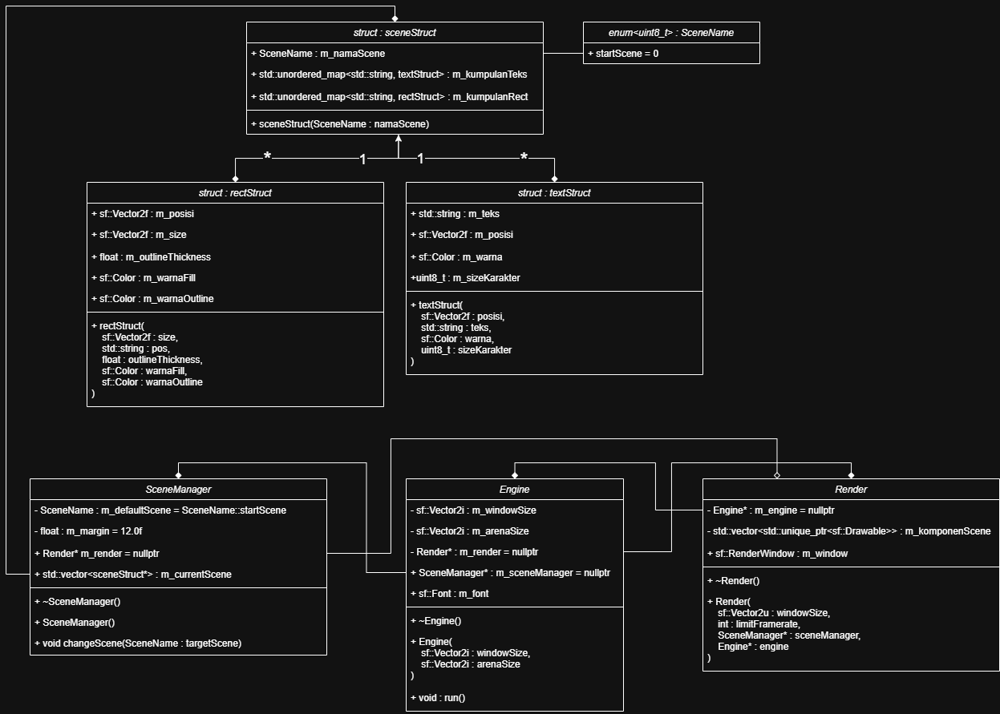

# TETRIS - SFML Game

A classic Tetris game built from scratch using C++ and the SFML (Simple and Fast Multimedia Library) framework, featuring a clean object-oriented architecture.

## 🚀 Features
* **Classic Gameplay:** Complete line clears, score tracking, and random block generation.
* **Scene Management:** Smooth transitions between screens (Main Menu, Gameplay, Pause, Game Over).
* **Robust Core:** Optimized rendering loop and modular engine design.

---

## 🛠️ System Architecture

Proyek ini dirancang menggunakan prinsip **Object-Oriented Design (OOD)** dengan pemisahan tanggung jawab (*Separation of Concerns*) yang jelas antara modul logika, rendering, dan manajemen data.

Berikut adalah blueprint **Class Diagram** dari sistem arsitektur game ini:



### Architectural Overview:
1. **Engine:** Jantung utama aplikasi yang mengatur *game loop*, inisialisasi window SFML, serta mengoordinasikan modul `Render` dan `SceneManager`.
2. **SceneManager:** Mengelola siklus hidup (*lifecycle*) dari `sceneStruct`. Bertanggung jawab membuat (*create*) dan menghancurkan (*destroy*) data scene secara dinamis (Komposisi).
3. **Render:** Modul khusus yang menangani penggambaran semua komponen visual ke layar menggunakan pointer referensi dari `Engine` dan data komponen aktif.
4. **Data Entities (`sceneStruct`, `rectStruct`, `textStruct`):** Struktur data pasif yang digunakan untuk menyimpan informasi koordinat, teks, dan komponen visual SFML secara terstruktur.

---

## 📁 Project Directory Structure

```text
TETRIS_SFML/
├── assets/             # Game assets (fonts, textures, sounds)
├── build/              # CMake build output directory
├── docs/               # Documentation & architecture diagrams
├── include/            # C++ Header files (.hpp)
└── src/                # C++ Source files (.cpp)
