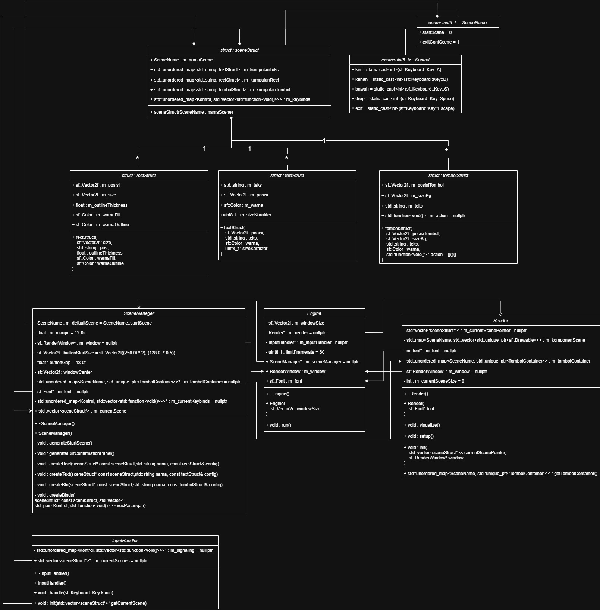

# TETRIS - SFML Game

Tetris yg gwh bikin dari 0 dgn fitur alokasi memory, optimasi cpu, efisiensi ram.

## 🚀 Fitur bwt gamer
* **(PLAN) Kustom Tetromino:** bisa kustom bentuk tetromino & ngesave datanya ke hardisk user
* **(WIP) Collision Realtime:** tetromino yg digerakin player bisa ngedetect & mencegah bentrokan terhadap arah pergeseran tetromino
* **(WIP) Skoring:** ngetrack skor tertinggi utk tiap game
* **(WIP) BGM & SFX:** ada musik dikit2 biar gk bosen bgt wkwk

## 🚀 Fitur bwt dev
* **Modularitas:** pembagian kerja program dibagi jdi beberapa modul
* **Scene berbasis stack:** penggunaan scene berbasis stack, scene yang paling diatas punya prioritas kontrol & render yg lebih superior daripada scene dibawahnya
* **Aman Leak (harusnya):** beberapa variabel dipakein smart pointer, walaupun ada beberapa yg masih make raw pointer tpi udh ditesting aman gk ada bocor memory 

---

## 🛠️ System Architecture

Kurng lebih diagramny gini:



---

## 📁 Project Directory Structure

```text
TETRIS_SFML/
├── assets/             # Game assets (fonts, textures, sounds)
├── build/              # CMake build output directory
├── docs/               # Documentation & architecture diagrams
├── include/            # C++ Header files (.hpp)
└── src/                # C++ Source files (.cpp)
